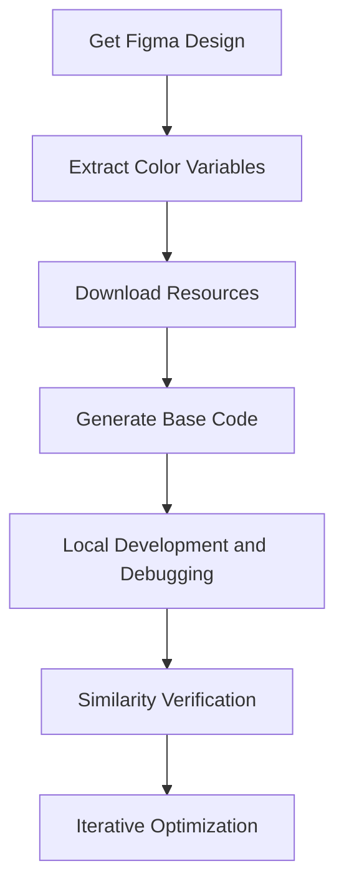

# Figma Integration

feuse-mcp provides powerful Figma design-to-code capabilities for frontend developers through built-in integration with [Figma-Context-MCP](https://github.com/GLips/Figma-Context-MCP/discussions).

## Prerequisites

Before using Figma integration features, you need:

1. **Figma API Key**: Obtain from [Figma Developer Settings](https://www.figma.com/developers/api#authentication)
2. **Design File Access**: Ensure you have access to the Figma files you want to process
3. **File Key and Node ID**: Know how to get this information from Figma URLs

## Automatically Get Figma File Information

### File Key (fileKey)
Extract from Figma file URL:
```
https://www.figma.com/file/ABC123/Design-File-Name
                           ^^^^^^
                      This is the fileKey
```

### Node ID (nodeId)
Get from URL parameters when selecting specific elements:
```
https://www.figma.com/file/ABC123/Design-File-Name?node-id=11675-21664
                                                           ^^^^^^^^^^^
                                                           This is the nodeId
```

## Core Figma Tools

### Figma-To-Code
Convert Figma designs directly to frontend code.

#### **Parameters:**
- `fileKey` (required): Figma file identifier
- `nodeId` (optional): Specific node ID, processes entire page if not specified

#### **Usage Example:**

```
<!-- vscode:  -->
#Figma-To-Code https://www.figma.com/file/ABC123/Design-File-Name?node-id=11675-21664
```

### extract-svg-assets
Intelligently analyze and extract SVG resources from Figma files.

#### **Parameters:**
- `fileKey` (required): Figma file identifier
- `nodeId` (optional): Specific node ID

#### **Features:**
- 🔍 **Smart Recognition**: Get Figma DSL structure based on FTC capability and automatically identify SVG icons and vector graphics
- 📁 **Batch Processing**: Support extracting multiple resources at once
- 🏗️ **Directory Organization**: Automatically create reasonable folder structure

#### **Usage Example:**

```
<!-- vscode:  -->
#extract-svg-assets https://www.figma.com/file/ABC123/Design-File-Name?node-id=11675-21664
```

### extract-color-vars
Extract color variables from Figma and convert to CSS variables or design tokens.

#### **Parameters:**
- `fileKey` (required): Figma file identifier
- `nodeId` (optional): Specific node ID

#### **Supported Output Formats:**
- **UnoCSS**: Generate `uno.config.ts` compatible color configuration
- **TailwindCSS**: Generate `tailwind.config.js` color extension
- **CSS Variables**: Generate standard CSS custom properties
- **Custom Format**: Custom output structure based on project requirements

#### **Usage Example:**

```
<!-- vscode:  -->
#extract-color-vars https://www.figma.com/file/ABC123/Design-File-Name?node-id=11675-21664
```

### similarity-figma
Compare visual similarity between generated code pages and original Figma designs.

**Parameters:**
- `url` (required): URL of the current project page
- `fileKey` (required): Figma file identifier
- `nodeId` (optional): Specific node ID

**Features:**
- 📊 **Similarity Comparison**: Provide quantified similarity analysis
- 📈 **Detailed Reports**: Generate improvement reports with suggestions
- 🎯 **Precise Comparison**: Support precise comparison of local regions
- 🔍 **Difference Detection**: Highlight major difference areas (#TODO)

#### **Usage Example:**

```
<!-- vscode:  -->
#similarity-figma 
http://localhost:8080
https://www.figma.com/file/ABC123/Design-File-Name?node-id=11675-21664
```


## Workflow Recommendations

### 1. Complete Design-to-Code Process


### 2. Batch Resource Processing
For design systems containing many icons:
1. Use `extract-svg-assets` to batch extract all icons
2. Establish color system through `extract-color-vars`
3. Use `Figma-To-Code` to generate component library framework

### 3. Component Development Verification
When developing individual components:
1. Use `Figma-To-Code` to generate component base code
2. Local debugging and feature improvement
3. Verify visual restoration through `similarity-figma`
4. Adjust based on comparison results

## Best Practices

### Design File Preparation
- **Unified Naming Convention**: Use clear naming for layers and components
- **Reasonable Hierarchical Structure**: Maintain clear design hierarchy
- **Component-based Design**: Use Figma component features to improve reusability

### Code Generation Optimization
- **Local Configuration Check**: Ensure ESLint, Prettier and other configurations are correct
- **Dependency Installation**: Install necessary UI libraries and toolkits
- **Unified Style System**: Use consistent CSS solutions (like TailwindCSS)

### Quality Control
- **Regular Similarity Checks**: Perform visual comparisons regularly during development
- **Multi-device Testing**: Verify responsive design effects
- **Performance Optimization**: Optimize generated code and resources

## Common Issues

### Q: How to handle complex Figma designs?
A: It's recommended to split complex designs into multiple smaller components, convert them separately, then combine.

### Q: What if the generated code doesn't match the design?
A: Use the `similarity-figma` tool for comparison analysis and make targeted adjustments based on the difference report.

### Q: How to handle custom fonts and special effects?
A: Ensure the local environment has the corresponding fonts installed; special effects may need manual CSS adjustments.

### Q: Which frontend frameworks are supported?
A: Currently supports React, Vue, HTML/CSS and other mainstream frontend technology stacks, automatically adapting based on project configuration.
