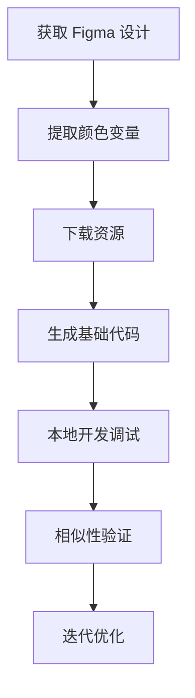

# Figma 集成

feuse-mcp 通过内置集成 [Figma-Context-MCP](https://github.com/GLips/Figma-Context-MCP/discussions)，为前端开发者提供强大的 Figma 设计转代码能力。

## 前提条件

在开始使用 Figma 集成功能之前，你需要：

1. **Figma API Key**: 从 [Figma 开发者设置](https://www.figma.com/developers/api#authentication) 获取
2. **设计文件访问权限**: 确保你有要处理的 Figma 文件的访问权限
3. **文件 Key 和节点 ID**: 了解如何从 Figma URL 中获取这些信息

## 自动获取 Figma 文件信息

### 文件 Key (fileKey)
从 Figma 文件 URL 中提取：
```
https://www.figma.com/file/ABC123/Design-File-Name
                           ^^^^^^
                      这就是 fileKey
```

### 节点 ID (nodeId)
从选中特定元素时的 URL 参数中获取：
```
https://www.figma.com/file/ABC123/Design-File-Name?node-id=11675-21664
                                                           ^^^^^^^^^^^
                                                           这就是 nodeId
```

## 核心 Figma 工具

### Figma-To-Code
将 Figma 设计直接转换为前端代码。

#### **参数：**
- `fileKey` (必需): Figma 文件标识符
- `nodeId` (可选): 特定节点 ID，未指定则处理整个页面


#### **使用示例：**

```
<!-- vscode:  -->
#Figma-To-Code https://www.figma.com/file/ABC123/Design-File-Name?node-id=11675-21664
```


### extract-svg-assets
智能分析和提取 Figma 文件中的 SVG 资源。

#### **参数：**
- `fileKey` (必需): Figma 文件标识符
- `nodeId` (可选): 特定节点 ID

#### **特性：**
- 🔍 **智能识别**: 基于FTC能力获取figma DSL结构，并自动识别 SVG 图标和矢量图形
- 📁 **批量处理**: 支持一次性提取多个资源
- 🏗️ **目录组织**: 自动创建合理的文件夹结构

#### **使用示例：**

```
<!-- vscode:  -->
#extract-svg-assets https://www.figma.com/file/ABC123/Design-File-Name?node-id=11675-21664
```

### extract-color-vars
提取 Figma 中的颜色变量并转换为 CSS 变量或设计令牌。

#### **参数：**
- `fileKey` (必需): Figma 文件标识符
- `nodeId` (可选): 特定节点 ID

#### **支持的输出格式：**
- **UnoCSS**: 生成 `uno.config.ts` 兼容的颜色配置
- **TailwindCSS**: 生成 `tailwind.config.js` 颜色扩展
- **CSS Variables**: 生成标准 CSS 自定义属性
- **自定义格式**: 根据项目需求自定义输出结构

#### **使用示例：**

```
<!-- vscode:  -->
#extract-color-vars https://www.figma.com/file/ABC123/Design-File-Name?node-id=11675-21664
```

### similarity-figma
比较生成的代码页面与原始 Figma 设计的视觉相似性。

**参数：**
- `url` (必需): 当前项目页面的 URL 地址
- `fileKey` (必需): Figma 文件标识符
- `nodeId` (可选): 特定节点 ID

**功能特点：**
- 📊 **相似度比对**: 提供量化的相似性分析
- 📈 **详细报告**: 生成包含建议的改进报告
- 🎯 **精确对比**: 支持局部区域的精确比较
- 🔍 **差异检测**: 高亮显示主要差异区域（#TODO）

## 工作流程建议

### 1. 设计转代码完整流程


### 2. 批量资源处理
对于包含大量图标的设计系统：
1. 使用 `extract-svg-assets` 批量提取所有图标
2. 通过 `extract-color-vars` 建立颜色系统
3. 用 `Figma-To-Code` 生成组件库框架

### 3. 组件开发验证
开发单个组件时：
1. 使用 `Figma-To-Code` 生成组件基础代码
2. 本地调试和完善功能
3. 通过 `similarity-figma` 验证视觉还原度
4. 根据对比结果进行调整

## 最佳实践

### 设计文件准备
- **统一命名规范**: 为图层和组件使用清晰的命名
- **合理的层级结构**: 保持清晰的设计层次
- **组件化设计**: 使用 Figma 组件功能提高复用性

### 代码生成优化
- **本地配置检查**: 确保 ESLint、Prettier 等配置正确
- **依赖项安装**: 安装必要的 UI 库和工具包
- **样式系统统一**: 使用一致的 CSS 方案（如 TailwindCSS）

### 质量控制
- **定期相似性检查**: 在开发过程中定期进行视觉对比
- **多设备测试**: 验证响应式设计的效果
- **性能优化**: 优化生成的代码和资源

## 常见问题

### Q: 如何处理复杂的 Figma 设计？
A: 建议将复杂设计拆分为多个较小的组件，分别进行转换，然后再组合。

### Q: 生成的代码与设计不匹配怎么办？
A: 使用 `similarity-figma` 工具进行对比分析，根据差异报告进行针对性调整。

### Q: 如何处理自定义字体和特殊效果？
A: 确保本地环境已安装相应字体，对于特殊效果可能需要手动调整 CSS。

### Q: 支持哪些前端框架？
A: 目前支持 React、Vue、HTML/CSS 等主流前端技术栈，会根据项目配置自动适配。
